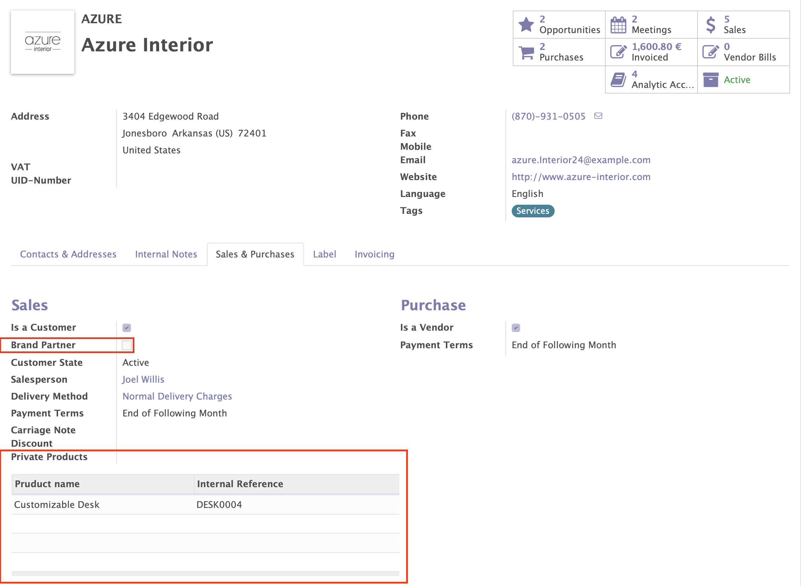
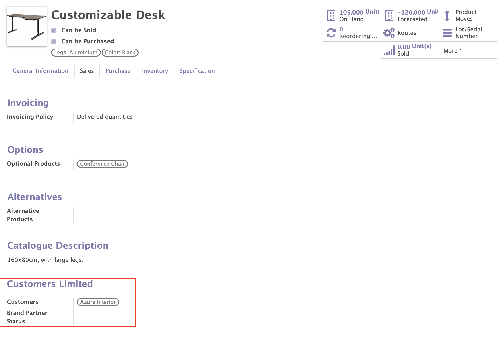

    <a href="https://www.odoo.com/documentation/12.0/index.html">
        </img>
    </a>
    <a href="http://www.alliantum.com">
        </img>
    </a>
    <a href="http://www.gnu.org/licenses/agpl-3.0-standalone.html">
        </img>
    </a>
    

    
    

        <h1>Brand Partner Products</h1>
        Restricted (private) products for Customers.
        

    

## Installation

This module depends on `odoo_invoice_addresses`. You can find it at [Alliantum/odoo_invoice_addresses](https://github.com/Alliantum/odoo_invoice_addresses)

## Usage

Install this add-on and it will be automatically ready to use.

Creates a relation between a product and a customer, and avoids selling those products to any other customer.

- In the _Contact_ form of a company you will find a new `Brand Partner` check box inside the _Sales & Purchases_ page, as well
as a `Private Products` table.
    

        
    

- In the _Product_ form there's a new section inside the _Sales_ page which contains `Customers` and `Brand Partner Status`.
    

        
    

## Contributors

- [Alliantum](http://www.alliantum.com)
